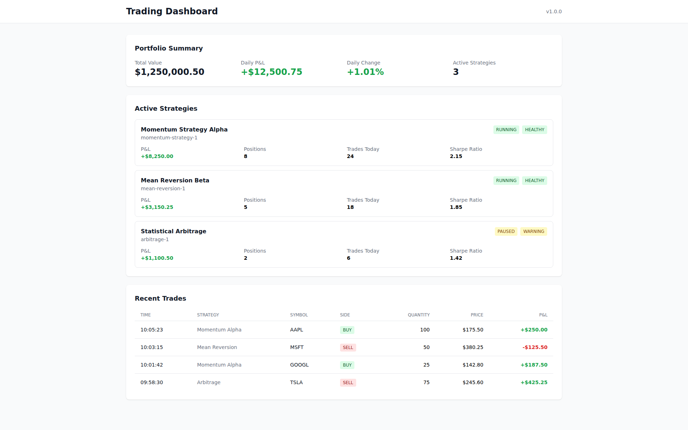
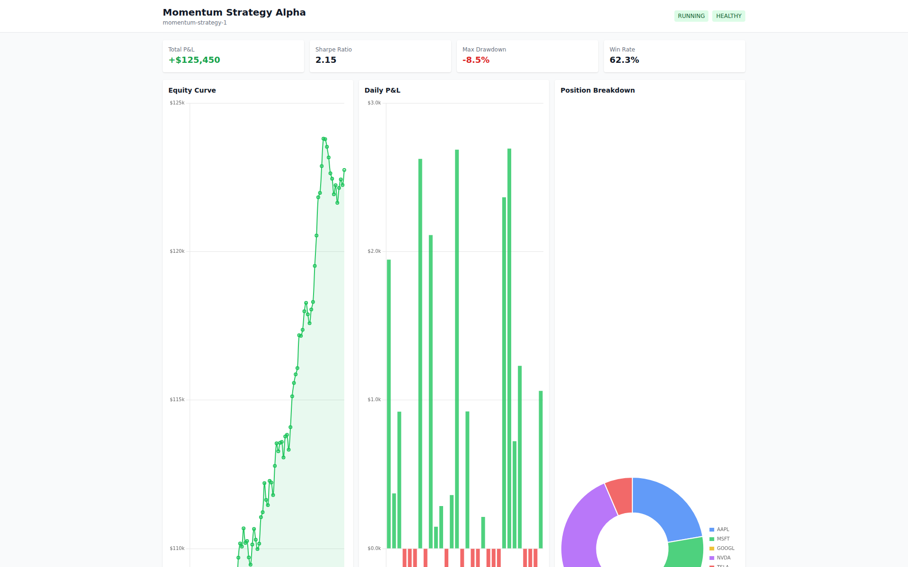
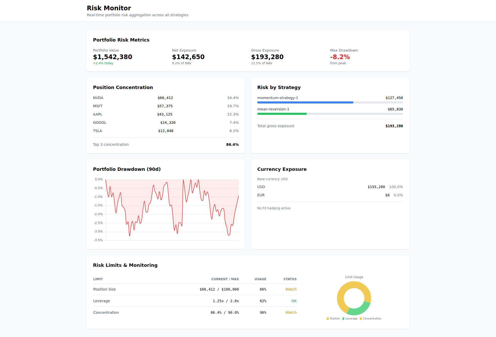
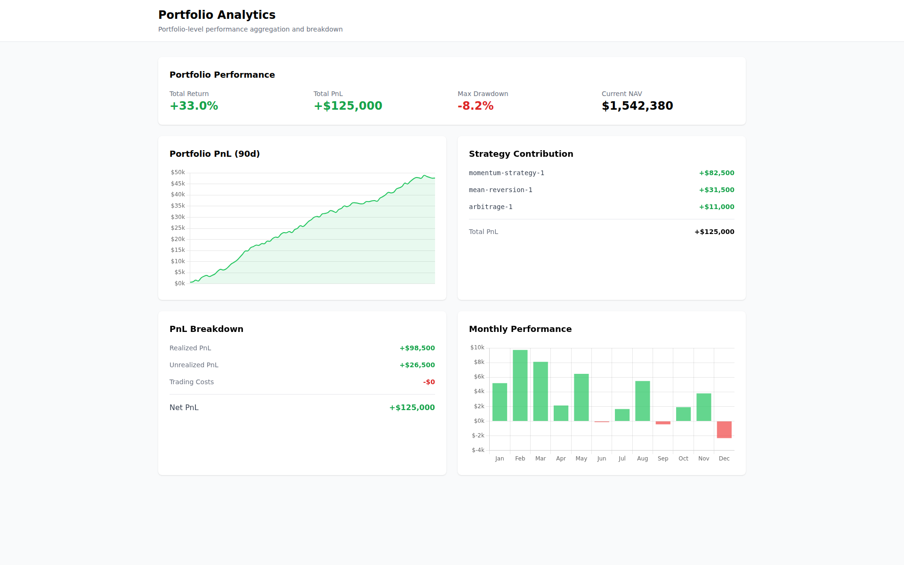

# Quantitative Trading & Risk Platform (C++ / .NET)

This repository showcases the design of a trading and risk platform, focusing on execution tracking, portfolio aggregation and real-time risk monitoring.

Quantitative software engineering project demonstrating how I design and structure production trading systems:
trades, positions, P&L and risk — all evolving consistently in real time.

> Full implementations are private and available upon request under NDA.

---

## 📊 Dashboard Overview

## 📈 Strategy Detail

## ⚠️ Risk Monitoring

## 📉 Portfolio Analytics

---

## 🧠 What This Project Demonstrates

This project focuses on **engineering aspects of trading systems**, not UI or product features.

Key areas:

* Real-time aggregation of portfolio and strategy state
* Consistent handling of trades, positions and P&L
* Risk monitoring (drawdown, exposure, concentration)
* Deterministic system behaviour under concurrent updates
* Clear separation between calculation logic and orchestration

---

## ⚙️ Core Capabilities

* Multi-strategy portfolio tracking
* Trade lifecycle and position reconciliation
* Real-time P&L and performance metrics
* Risk calculations (drawdown, exposure, limits)
* Scenario-based portfolio analysis

---

## 🔄 Example Workflow

The platform is designed around a consistent flow from execution to portfolio state.

For example:

* A strategy generates an order
* The order is executed and produces trades
* Trades update positions and portfolio state
* P&L and exposure are recalculated in real time
* Risk metrics (drawdown, concentration, limits) are updated immediately
* The dashboard reflects the updated system state

The key requirement is that all these steps remain **consistent and deterministic**, even under concurrent updates.

---

## 🏗️ Engineering Focus

The implementation emphasizes:

* **Correctness over features**
* **Deterministic state handling**
* **Thread-safe execution and aggregation**
* **Robust error handling and recovery**
* **Clear system boundaries and responsibilities**

This reflects the same design concerns encountered in production trading and risk systems.

Design patterns reflect real-world integration with trading platforms (e.g. Sophis) and pricing systems.

---

## 📚 Additional Notes

* This is a **portfolio project**, not a production trading system
* No real trading or financial advice functionality is provided
* Architecture details are intentionally kept at a high level

---

## 📞 Contact

For discussions on system design, quantitative models, or implementation details:

Full code and deeper technical walkthroughs are available upon request.
