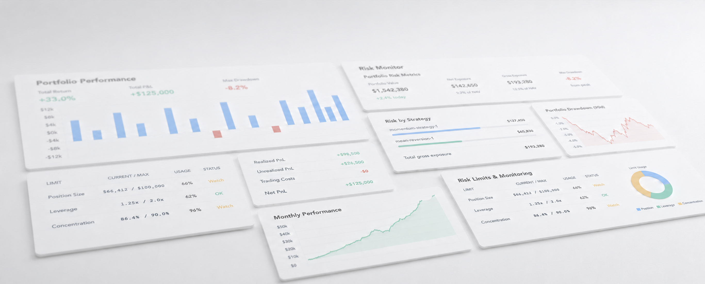

  

# Tom Honorez
## Algorithmic Trading Platform
**Multi-Strategy Execution, Backtesting & Risk Monitoring**

Multi-strategy algorithmic trading platform for developing, validating and executing quantitative trading strategies across multiple markets and asset classes.

Supports the complete trading workflow—from strategy research and backtesting to live execution, portfolio management and real-time risk monitoring.

---

## What It Does

**Strategy Development & Backtesting**  
Develop systematic trading strategies with integrated backtesting framework. Test strategies against historical data before deployment to validate performance and risk characteristics.

**Multi-Strategy Execution**  
Execute multiple independent trading strategies concurrently with coordinated portfolio management. Each strategy operates in isolation while maintaining portfolio-wide risk aggregation and monitoring.

**Real-Time Risk Management**  
Monitor portfolio exposure, drawdown, and risk metrics in real-time. Automated limit enforcement and alert generation ensure risk parameters remain within defined boundaries.

**Portfolio Analytics**  
Track performance across strategies with detailed attribution analysis. Real-time P&L calculation, position tracking, and exposure monitoring provide complete portfolio visibility.

---

## Documentation

**[Trading Strategies & Execution →](./TRADING.md)**  
Strategy types, development workflow, market coverage, and execution infrastructure.

**[System Architecture →](./ARCHITECTURE.md)**  
Technical infrastructure: concurrent processing, state management, fault tolerance, and operational reliability.

**[Quantitative Analytics →](./PRICING.md)**  
Derivatives pricing, risk analytics, and quantitative models for strategy development and risk analysis.

---

## Technology Stack

**Core Platform:** C++17 for high-performance execution and state management  
**Quantitative Library:** Python for strategy research and analytics  
**Messaging:** RabbitMQ (AMQP) and Kafka for reliable event streaming  
**Monitoring:** React-based dashboards with real-time WebSocket updates  
**Data Processing:** Time-series analysis and statistical modeling  

---

## Current Status

**Operational:**
- Multi-strategy execution framework
- Real-time portfolio aggregation
- Risk monitoring and alerts
- Backtesting infrastructure

**In Development:**
- Live exchange connectivity (Binance, Coinbase, Kraken)
- Database persistence layer
- Extended strategy library
- Mobile monitoring application

---

## Technical Highlights

**System Architecture:** Event-driven infrastructure with deterministic state management, concurrent multi-strategy execution, and fault-tolerant processing. See **[Architecture](./ARCHITECTURE.md)** for details.

**Quantitative Analytics:** Integrated library for derivatives pricing, risk analytics, and scenario analysis across multiple asset classes. See **[Analytics](./PRICING.md)** for details.

---

## About

**Tom Honorez** - Quantitative Software Engineer specializing in trading systems, real-time infrastructure, and quantitative analytics.

The platform integrates trading infrastructure (C++), quantitative analytics (Python), and modern monitoring tools (React) for systematic strategy development, execution and risk management.

**Professional Focus:**
- Trading systems architecture and infrastructure
- Real-time portfolio and risk management systems
- Quantitative analytics and derivatives pricing
- High-performance concurrent processing
- Financial software engineering

**Contact:** [LinkedIn](https://linkedin.com/in/tomhonorez) | tom.honorez@outlook.com
